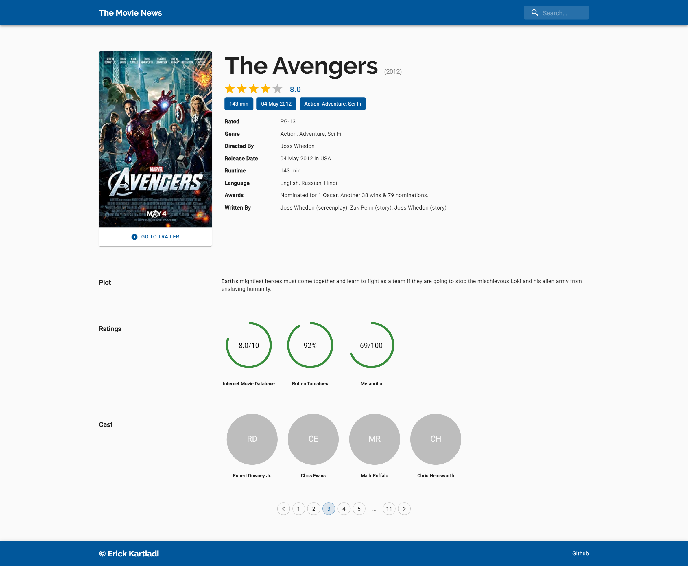

# Movie App

A personal movie app project to sharpen React frontend skills

# Features

1. Search movies
2. Show movie details

## Screenshot

Homepage:

Detail Page:

## API Reference

This project is created using [OMDBAPI](https://www.omdbapi.com/)

## Acknowledgements

This application makes use of the following third party libraries:

1. [Material UI](https://material-ui.com/)
2. [UUID](https://www.npmjs.com/package/uuid)
3. [React Loader Spinner](https://www.npmjs.com/package/react-loader-spinner)
4. [Axios](https://www.npmjs.com/package/axios)
5. [Github Pages](https://www.npmjs.com/package/gh-pages)

## Contact

If you want to contact me you can reach me at erickcartiady@gmail.com
